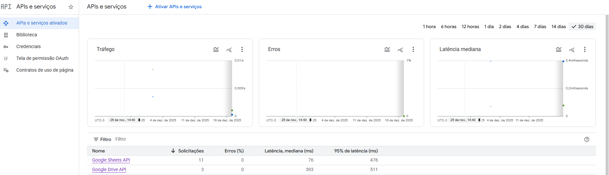

# Google Sheets to SQL ETL Pipeline

Pipeline de Engenharia de Dados desenvolvido para automatizar a extração, validação e carregamento de dados de planilhas distribuídas (Google Sheets) para um Data Warehouse local (SQLite).

O projeto utiliza a infraestrutura de nuvem do Google (GCP) para autenticação segura e consumo de dados via API, simulando um cenário real de centralização de dados corporativos (Shadow IT) para um ambiente analítico estruturado.

## Funcionalidades Técnicas

**Integração com Google Cloud Platform (GCP)**
Configuração de projeto no console da GCP, gerenciamento de Service Accounts (IAM) e ativação das APIs Google Drive e Google Sheets para leitura programática e segura dos dados na nuvem.

**Pipeline ETL**
* **Extract:** Conexão autenticada via JSON de credenciais para leitura de múltiplas abas de planilhas.
* **Transform:** Limpeza de dados utilizando Pandas (conversão de tipos monetários, parsing de datas ISO e tratamento de nulos).
* **Load:** Persistência dos dados tratados em banco de dados relacional (SQLite), gerando o arquivo `vendas_dw.db` pronto para conexão com ferramentas de BI.

**Qualidade e Observabilidade**
* **Validação de Schema:** Implementação de Quality Gates que verificam a existência de colunas obrigatórias antes do processamento, rejeitando arquivos fora do padrão.
* **Logging:** Sistema de logs detalhado (arquivo `.log` e console) para auditoria de execução e rastreabilidade de erros.
* **Segurança:** Gestão de credenciais sensíveis através de variáveis de ambiente (`.env`).

## Monitoramento de API (GCP)

Visualização do tráfego de requisições e latência das APIs utilizadas no projeto, monitoradas via Google Cloud Console.

## Como Executar

**Pré-requisitos**
* Python 3.8 ou superior
* Conta Google Cloud com projeto ativo e credenciais (JSON) geradas

**Instalação**

1. Clone o repositório

git clone [https://github.com/HeitorRangel/automacao-sheets-etl.git](https://github.com/HeitorRangel/automacao-sheets-etl.git)

cd automacao-sheets-etl

2. Instale as Dependências

pip install -r requirements.txt

3. Configuração 
Crie um arquivo .env na raiz do projeto e adicione o caminho das suas credenciais:

GOOGLE_CREDENTIALS_PATH="caminho/para/suas/credenciais.json"
NOME_ARQUIVO_SAIDA="dashboard.xlsx"

4. Execução

python automacao-sheets.py

## Estrutura do Banco de Dados

O script gera automaticamente o arquivo vendas_dw.db com a seguinte tabela consolidada:

  Data (DATETIME)

  Vendedor (TEXT)

Produto (TEXT)

Quantidade (INTEGER)

Valor Unitario (REAL)

Total (REAL)

### Autor
Heitor Espinosa de C. Rangel [LinkedIn ](https://www.linkedin.com/in/heitorespinosa/)| heitorespinosa@gmail.com
